**Basic Git Workflow**

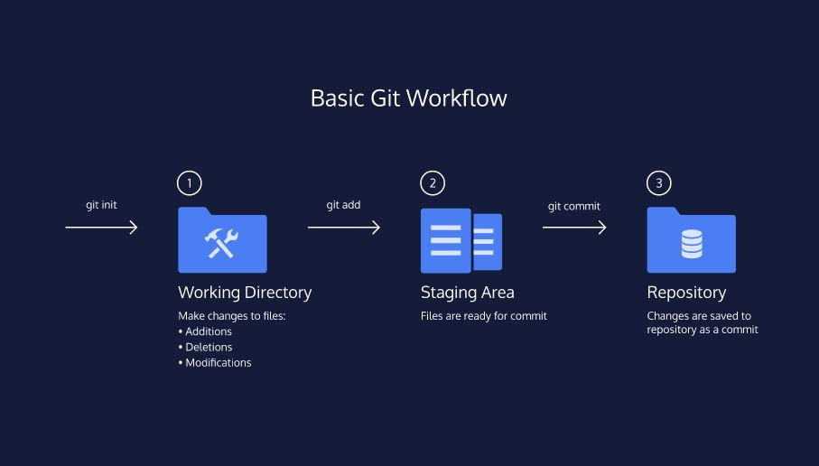

LESSON 1

An introduction to Git and a few of its core features.

Exercises

- [X] 1. Hello Git

- [X] 2. git init

- [x] 3. Git Workflow

- [x] 4. git status

- [x] 5. git add

- [x] 6. git diff

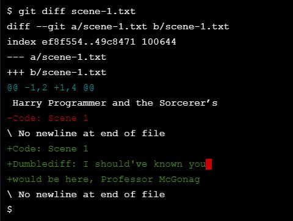

- [x] 7. git commit

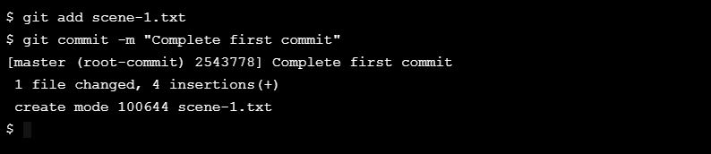

- [x] 8. git log

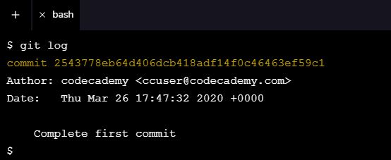

- [x] 9. Generalizations

---

[Getting Started with Git and GitHub](https://www.codecademy.com/courses/learn-git/articles/f1-u3-git-setup)

**How to Backtrack**

LESSON 2

Learn about a few different ways to undo changes made to a Git project and when to use them.

Exercises

- [x] 1. Backtracking Intro

- [x] 2. head commit

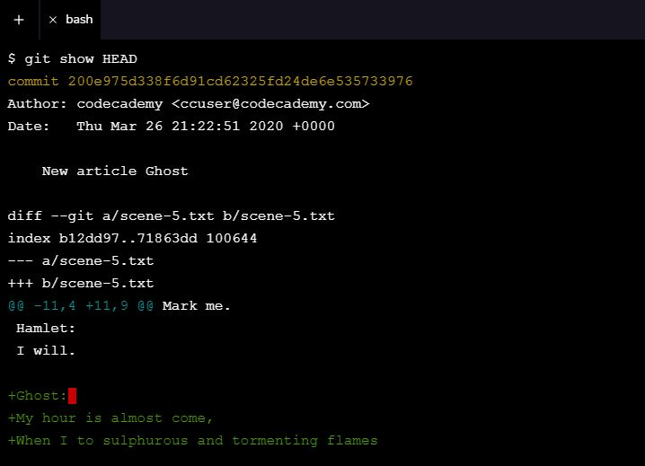

- [x] 3. git checkout

- [x] 4. more git add

- [x] 5. git reset I

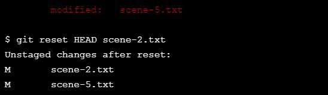

- [x] 6. git reset II

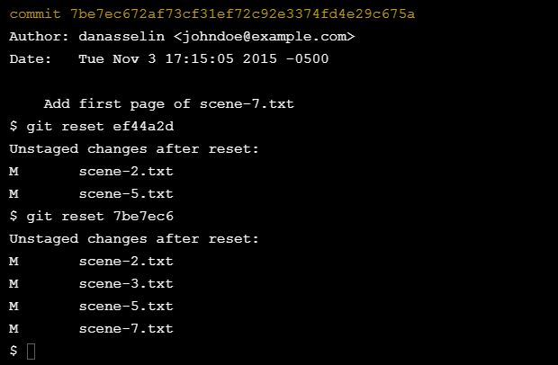

- [x] 7. git reset review

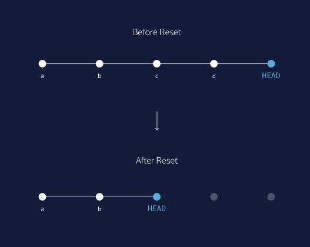

- [x] 8. Generalizations

**Git Branching**

LESSON 3

Learn how to manage multiple versions of a project with branching.

Exercises

- [x] 1. git branch

- [x] 2. branching overview

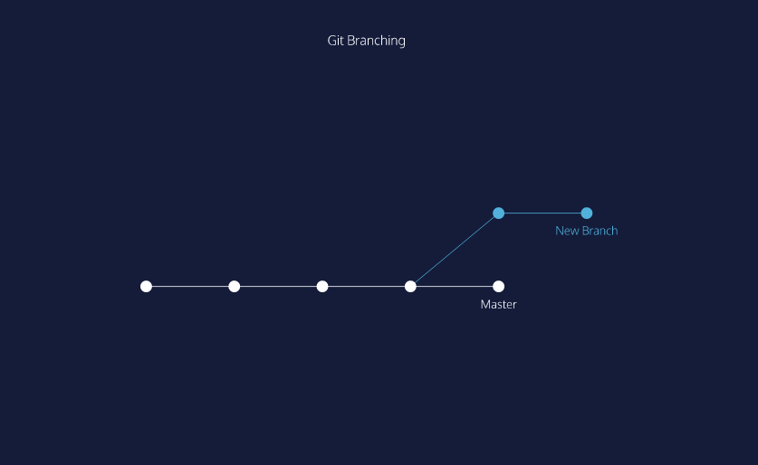

- [x] 3. git branch 2

- [x] 4. git checkout

- [x] 5. commit on a new branch

- [x] 6. git merge

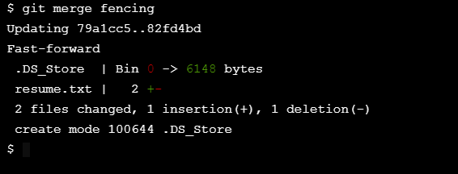

- [x] 7. merge conflict I

- [x] 8. merge conflict II

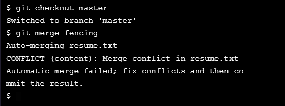

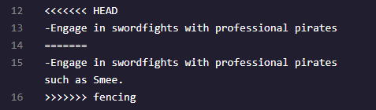

- [x] 9. delete branch

- [x] 10. generalizations

**Git Teamwork**

LESSON 4

An introduction to Git collaborations with remotes, pulling, and pushing.

Exercises

- [x] 1. Overview

- [x] 2. git clone

- [x] 3. git remote -v

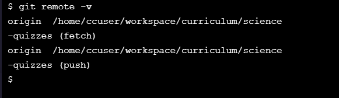

- [ ] 4. git fetch

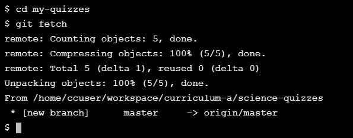

- [x] 5. git merge

- [x] 6. Git workflow

- [x] 7. git push

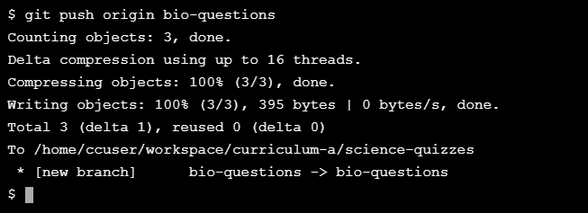